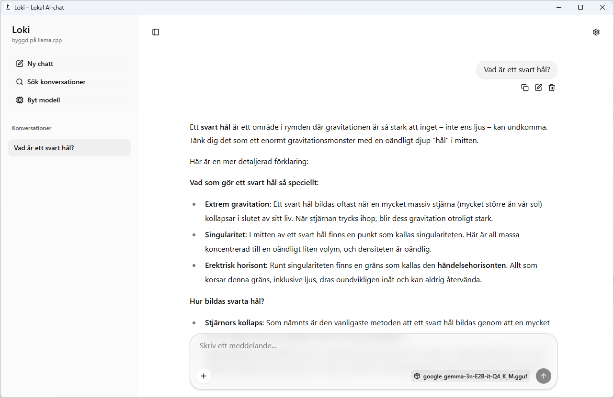

# LOKI – Lokal, Oberoende, Konfidentiell Intelligens

**LOKI** står för **L**okal, **O**beroende, **K**onfidentiell **I**ntelligens. Det är en stensäker, integritetsfokuserad AI-chatt som körs till 100 % på din egen maskin. Inga molntjänster. Inga prenumerationer. Dina ord lämnar aldrig din enhet.

Under huven drivs appen av [llama.cpp](https://github.com/ggml-org/llama.cpp) via en inbäddad server, med fullt stöd för ett brett urval av GGUF-modeller och blixtsnabb hårdvaruacceleration (Vulkan på Windows, Metal på macOS).

---

## Varför välja Loki?

De flesta moderna AI-assistenter gör dig beroende av en tredjepart – du skickar dina frågor till ett externt datacenter där de bearbetas, loggas och analyseras innan du får ett svar. Dina privata konversationer, arbetsdokument och idéer passerar genom system du helt saknar kontroll över.

Loki ger dig makten tillbaka. Modellen bor hos dig. Beräkningen sker lokalt. Du är helt oberoende av uppkoppling och allt du gör förblir strikt konfidentiellt.

---

## Säkerhet och integritet på riktigt

Att köra AI lokalt handlar inte bara om noll driftkostnader – det är den enda garantin för total digital integritet.

| Vad Loki *inte* gör | Varför det spelar roll |
| --- | --- |
| **Inga API-anrop till externa servrar** | Dina frågor och svar lämnar aldrig ditt eget nätverk. |
| **Inget konto, ingen inloggning** | Det finns inga användaruppgifter som kan läcka, säljas eller kapas. |
| **Ingen telemetri eller loggning** | Loki spionerar inte på dig och samlar inte in någon användningsdata. |
| **Inget internetkrav (efter nedladdning)** | Helt oberoende. Fungerar perfekt offline, på isolerade nätverk eller bakom strikta brandväggar. |
| **Allt sparas lokalt (IndexedDB)** | Du äger din konfidentiella historik fullt ut – ingen annan kan komma åt den. |

Loki är det perfekta verktyget för att bolla känsliga ämnen, effektivisera interna arbetsflöden, granska konfidentiella dokument och hantera alla situationer där du vägrar låta en tredje part tjuvlyssna.

> **Obs:** Modellfilerna laddas ner från Hugging Face första gången du använder dem. Därefter krävs ingen som helst internetuppkoppling för att använda appen.

---

## Nyckelfunktioner

* **100 % lokal AI** – All tankekraft genereras av din egen hårdvara, helt oberoende av molnet.
* **Färdiga "smaker"** – Fem förvalda, optimerade modeller som laddas ner direkt i appen med ett klick.
* **Magisk Chunking (Map-Reduce)** – Appen känner automatiskt av om en text är för stor för kontextfönstret och delar upp den i bitar för att kunna sammanfatta timmar av material utan informationsförlust.
* **Dynamiskt kontextstöd** – Justera storleken på AI-minnet (tokens) med en enkel slider för att optimera prestanda vs. RAM.
* **Smart RAM-varning** – Appen beräknar minnesbehovet i realtid och varnar om inställningarna riskerar att överstiga din dators tillgängliga RAM.
* **Sömlösa modellbyten** – Byt AI-modell i farten från sidomenyn, utan att behöva starta om appen.
* **Konfidentiell datahantering** – Bifoga textfiler, PDF:er och bilder direkt i din chatt utan risk för dataläckage.
* **Lokal historik** – Alla konversationer sparas tryggt och krypterat i webbläsarens IndexedDB.
* **Anpassningsbar systemprompt** – Skräddarsy AI:ns personlighet och beteende för varje unik uppgift.
* **Import & Export** – Säkerhetskopiera eller flytta dina konversationer smidigt mellan dina egna enheter.
* **Visuella teman** – Välj mellan ljust, mörkt eller ett terminalinspirerat grönt retro-tema med scanlines.
* **Helt på svenska** – Gränssnittet är skapat och fullt översatt för svenska användare.
* **Portabelt läge** – Kan köras direkt från mappen utan installation (kräver WebView2 på Windows).

---
