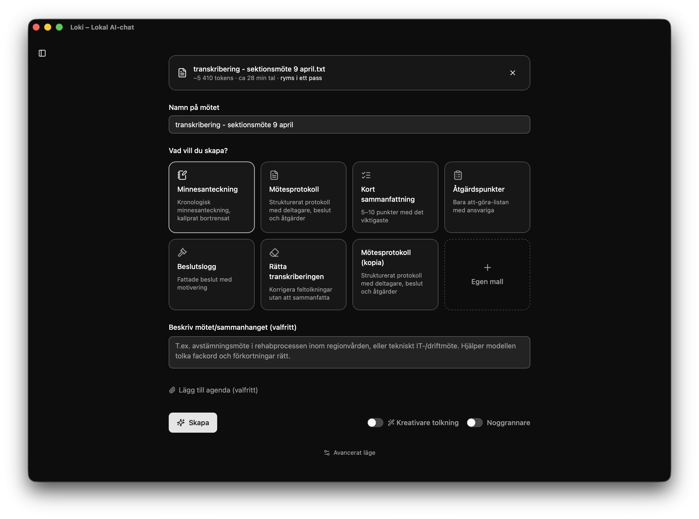

# LOKI – Lokal, Oberoende, Konfidentiell Intelligens

**LOKI** står för **L**okal, **O**beroende, **K**onfidentiell **I**ntelligens. Det är ett stensäkert, integritetsfokuserat verktyg för att **sammanfatta och protokollföra mötestranskriberingar** – helt lokalt på din egen maskin. Inga molntjänster. Inga prenumerationer. Dina ord lämnar aldrig din enhet.

Släpp in en transkribering (t.ex. exporterad från Teams eller Zoom), välj vad du vill skapa – minnesanteckning, mötesprotokoll, åtgärdspunkter – och få ett färdigt dokument. Allt sker offline. För den som vill finns även ett **avancerat läge** med full AI-chatt.

Under huven drivs appen av [llama.cpp](https://github.com/ggml-org/llama.cpp) via en inbäddad server, med Google Gemma 4-modeller (GGUF) och blixtsnabb hårdvaruacceleration (Vulkan på Windows, Metal på macOS).



---

## Varför välja Loki?

De flesta moderna AI-assistenter gör dig beroende av en tredjepart – du skickar dina frågor till ett externt datacenter där de bearbetas, loggas och analyseras innan du får ett svar. Dina privata konversationer, arbetsdokument och idéer passerar genom system du helt saknar kontroll över.

Loki ger dig makten tillbaka. Modellen bor hos dig. Beräkningen sker lokalt. Du är helt oberoende av uppkoppling och allt du gör förblir strikt konfidentiellt.

**Lokis huvudsyfte:**

**Mötesanteckningar från transkriberingar** – Klistra in eller bifoga din transkribering (t.ex. exporterad från Teams, Zoom eller liknande) och låt Loki skapa strukturerade mötesanteckningar med beslut, action points och nyckelinformation. Allt sker lokalt – transkriberingen lämnar aldrig din enhet.

---

## Så fungerar sammanfattningsläget

Startvyn är ett enkelt flöde i tre steg:

1. **Släpp in transkriberingen** (.txt/.md/.pdf). Loki räknar tokens och avgör automatiskt om texten ryms i ett pass eller behöver delas upp.
2. **Välj vad du vill skapa** – en av de inbyggda mallarna eller en egen:
   - **Minnesanteckning** – kronologisk, kallprat bortrensat (förval)
   - **Mötesprotokoll** – strukturerat med deltagare, beslut och åtgärder
   - **Kort sammanfattning** – 5–10 punkter med det viktigaste
   - **Åtgärdspunkter** – bara att-göra-listan med ansvariga
   - **Beslutslogg** – fattade beslut med motivering
   - **Rätta transkriberingen** – korrigerar feltolkningar utan att sammanfatta
   - **Egna mallar** – skapa, redigera och spara dina egna (även från ett malldokument)
3. **Klicka Skapa** – resultatet streamas fram och sparas i historiken. Kopiera, exportera som fil eller kopiera direkt till Word.

**Extra finesser:**

- **Beskriv sammanhanget** – ange mötets domän (t.ex. "rehabprocess inom regionvården" eller "tekniskt IT-möte") så tolkar modellen fackord, förkortningar och feltolkade ord rätt. Spara återkommande sammanhang som förval.
- **Justera resultatet** – ge egna direktiv på det färdiga dokumentet (t.ex. "_Kulturum_ ska vara _Qulturum_") och kör om – itererbart, på samma modell.
- **Kreativare tolkning** – en växel som låter sammanhanget forma ton och struktur friare (utan att hitta på fakta).
- **Noggrannare** – låter modellen resonera (thinking) för djupare sammanfattningar.
- **Agenda** – bifoga en agenda så struktureras protokollet efter dess punkter.
- **Långa möten** – väldigt långa transkriberingar delas automatiskt upp och slås ihop kronologiskt (map-reduce), så även små modeller håller tråden.
- **RAM-medvetet kontextfönster** – Loki anpassar kontextstorleken efter din dators minne och vald modell, så att stora modeller inte spränger minnet.

---

## Säkerhet och integritet på riktigt

Att köra AI lokalt handlar inte bara om noll driftkostnader – det är den enda garantin för total digital integritet.

| Vad Loki _inte_ gör                        | Varför det spelar roll                                                                          |
| ------------------------------------------ | ----------------------------------------------------------------------------------------------- |
| **Inga API-anrop till externa servrar**    | Dina frågor och svar lämnar aldrig ditt eget nätverk.                                           |
| **Inget konto, ingen inloggning**          | Det finns inga användaruppgifter som kan läcka, säljas eller kapas.                             |
| **Ingen telemetri eller loggning**         | Loki spionerar inte på dig och samlar inte in någon användningsdata.                            |
| **Inget internetkrav (efter nedladdning)** | Helt oberoende. Fungerar perfekt offline, på isolerade nätverk eller bakom strikta brandväggar. |
| **Allt sparas lokalt (IndexedDB)**         | Du äger din konfidentiella historik fullt ut – ingen annan kan komma åt den.                    |

Loki är det perfekta verktyget för att bolla känsliga ämnen, effektivisera interna arbetsflöden, granska konfidentiella dokument och hantera alla situationer där du vägrar låta en tredje part tjuvlyssna.

> **Obs:** Modellfilerna laddas ner från Hugging Face första gången du använder dem. Därefter krävs ingen som helst internetuppkoppling för att använda appen.

---

## Nyckelfunktioner

- **100 % lokal AI** – All tankekraft genereras av din egen hårdvara, helt oberoende av molnet.
- **Färdiga "smaker"** – Ett kurerat urval av optimerade Google Gemma 4-modeller (GGUF) som laddas ner direkt i appen. Välj utifrån din dators minne; större modeller ger bättre kvalitet.
- **Modeller som ingår**:
  | Modell | Storlek | RAM-krav | Fokus |
  | :--- | :--- | :--- | :--- |
  | **Gemma 4 E2B** | ~3.5 GB | 5 GB+ | Blixtsnabb, multimodal, 128K kontext (förval) |
  | **Gemma 4 E4B** | ~6.9 GB | 9 GB+ | Analytisk, multimodal, 128K kontext |
  | **Gemma 4 12B (QAT, snabb)** | ~6.7 GB | 16 GB+ | Kraftfullast, 256K kontext, QAT 4-bit (nära originalkvalitet) |
  | **Gemma 4 12B (Q5, vassare)** | ~8.6 GB | 18 GB+ | Som ovan men högre bitdjup – något vassare, tyngre |

> [!NOTE]
> 12B-modellerna kan köras även på datorer med 16 GB RAM – då via CPU om grafikminnet inte räcker (långsammare men fungerar). Loki varnar men blockerar inte.

> [!TIP]
> **Upplever du att en modell inte startar?** Om du har ett grafikkort med begränsat VRAM (t.ex. 6 GB), prova att sänka **Context Size** i inställningarna till 4096 eller 2048. Detta minskar minneskravet avsevärt vid start.

> [!TIP]
> **Problem med GPU på Windows (t.ex. AMD Radeon)?** Testa CPU-versionen av Loki (`loki-cpu`) som inte använder Vulkan alls. Den är något långsammare men fungerar på i stort sett all hårdvara.

- **Automatiskt kontextfönster** – Appen utökar kontextfönstret automatiskt när en text är för stor och kör om förfrågan, utan att du behöver justera inställningar.
- **Resonemang (Thinking)** – Modeller som stödjer intern tankeprocess (som Gemma 4) kan resonera igenom svaret innan de svarar. Ger djupare och mer genomtänkta svar på komplexa frågor. Kan slås av i inställningarna för snabbare konversation.

- **Hårdvaruacceleration med kontroll** – Drar nytta av Vulkan (Windows) eller Metal (macOS). Möjlighet att manuellt välja GPU-index för att tvinga fram rätt grafikkort på t.ex. bärbara datorer.
- **Automatisk CUDA på NVIDIA** – Har du ett NVIDIA-grafikkort använder Loki automatiskt CUDA för bästa prestanda. Nödvändiga runtime-filer buntas med appen – endast NVIDIA-drivrutinen krävs (ingen separat CUDA-installation behövs). Saknas CUDA-stöd faller appen tillbaka till Vulkan och därefter CPU.
- **CPU-version för AMD och äldre hårdvara** – En separat CPU-build (utan Vulkan) finns tillgänglig för maskiner där GPU-versionen inte fungerar, t.ex. vissa AMD Radeon-konfigurationer.
- **Dynamiskt kontextstöd** – Justera storleken på AI-minnet (tokens) med en enkel slider för att optimera prestanda vs. RAM.
- **Smart RAM-varning** – Appen beräknar minnesbehovet i realtid och varnar om inställningarna riskerar att överstiga din dators tillgängliga RAM.
- **Sömlösa modellbyten** – Byt AI-modell i farten från sidomenyn, utan att behöva starta om appen.
- **Konfidentiell datahantering** – Bifoga textfiler, PDF:er och bilder direkt i din chatt utan risk för dataläckage.
- **Lokal historik** – Alla konversationer sparas tryggt och krypterat i webbläsarens IndexedDB.
- **Anpassningsbar systemprompt** – Skräddarsy AI:ns personlighet och beteende för varje unik uppgift.
- **Import & Export** – Säkerhetskopiera eller flytta dina konversationer smidigt mellan dina egna enheter.
- **Visuella teman** – Välj mellan ljust, mörkt eller ett terminalinspirerat grönt retro-tema med scanlines.
- **Helt på svenska** – Gränssnittet är skapat och fullt översatt för svenska användare.
- **Portabelt läge** – Kan köras direkt från mappen utan installation (kräver WebView2 på Windows).
- **Inbyggd binärhantering** – Under _Inställningar → System_ visas vilken version av llama.cpp-servern som är installerad. Du kan uppdatera till senaste release med ett klick, direkt inifrån appen.

---

## Installation & Felsökning

### macOS: "Appen är skadad och kan inte öppnas"

Eftersom Loki inte är digitalt signerad via Apples betalda utvecklingsprogram kan macOS visa ett felmeddelande om att appen är skadad när den laddas ner via en webbläsare. Detta är en säkerhetsfunktion i Gatekeeper.

För att fixa detta, öppna **Terminalen** och kör följande kommando:

```bash
sudo xattr -rd com.apple.quarantine /Applications/Loki.app
```

_(Om du har flyttat appen till en annan mapp än Applications, justera sökvägen i kommandot)._

### Windows: "SmartScreen förhindrade att en okänd app startades"

Klicka på **"Mer information"** och sedan **"Kör ändå"**. Appen kräver även [WebView2 Runtime](https://developer.microsoft.com/en-us/microsoft-edge/webview2/) (finns oftast redan installerat i Windows 10/11).
